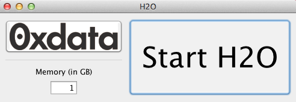

From an Installer Package
--------------------------

From the website below choose download installer for mac or windows as appropriate, and follow the installation helper to install H2O. 

::
  
   MAC USERS: https://s3.amazonaws.com/h2o-release/master/493/h2o-1.7.0.493-osx-installer.dmg
   
::

   WINDOWS USERS: https://s3.amazonaws.com/h2o-release/master/493/h2o-1.7.0.493-windows-installer.exe

::

  OTHERS USERS: https://s3.amazonaws.com/h2o-release/master/493/h2o-1.7.0.493.zip

An installation helper will guide you through the rest of the installation. 

Find the installed application in the installation directory, and double click on the H2O icon. A simple launcher will open. Clicking on **0xdata** in the upper left corner will take you to the 0xdata documents website, where you can find more information. 

To adjust the amount of memory that is allocated to H2O, enter the appropriate level of memory in GB. A good guideline for memory allocation is that memory allocation should be 4x the size of your data, but never more than the total amount of memory on your
computer.

Click "Start H2O". After a brief pause, the default web browser will launch, opening to the user interface for H2O. Further information on using the interface can be found in the User Guide. Algorithm specific tutorials can be found in Tutorials. Both of these can be easily accessed by clicking on the **Help** drop down menu at the top of the page.  

**IMPORTANT NOTE**
It is important to understand that the H2O program is using the memory resources of the machine on which it is running. To free those resources, users must return to the H2O launcher and click the **Stop H2O** button. H2O will continue to run until it is stopped regardless of whether the web based interface is closed. 

Using R with the installer package
""""""""""""""""""""""""""""""""""

Users who wish to use R should follow the above instructions including launching H2O by clicking on the **Start H2O** button in the launcher. The browser based interface can be closed; H2O will continue to run. 

Note that the installation of H2O created a file on the desktop. 

Open the R console. In the R console install the library by entering the following command at the prompt:

::

  >install.packages("/Users/UserName/Desktop/h2o file name/R/ **tar.gz file name**", repos = NULL, type = "source")
  

**To find the tar.gz file name**, go to h2o file ==> R, and find the file with the extension ".tar.gz."  

For example, a user at 0x data enters the following into her R console at the command prompt:

::

  >install.packages("/Users/Irene/Desktop/h2o-1.5.6137/R/h2o_1.5.6.137.tar.gz", repos = NULL, 
  type = "source")

Which returns the following output

::

  * installing *source* package ‘h2o’ ...
  ** R
  ** demo
  ** inst
  ** preparing package for lazy loading
  Creating a generic function for ‘colnames’ from package ‘base’ in package ‘h2o’
  Creating a generic function for ‘nrow’ from package ‘base’ in package ‘h2o’
  Creating a generic function for ‘ncol’ from package ‘base’ in package ‘h2o’
  Creating a generic function for ‘summary’ from package ‘base’ in package ‘h2o’
  Creating a generic function for ‘as.data.frame’ from package ‘base’ in package ‘h2o’
  ** help
  *** installing help indices
  ** building package indices
  ** testing if installed package can be loaded
  * DONE (h2o)
 

**R Studio users** can install the H2O package by finding the tabbed menu "File; Plots; Packages; Help" and choosing *Packages*. Clicking on *Install Packages* brings up an installation helper. Choose *Package Archive File (tgz; .tar.gz)* in the *"Install From"* field. Click browse and follow the helper to specify Desktop ==> h2o file ==> R ==> .tar.gz file. *Click "Open". Click "Install"*

All R users (both console and R Studio) Enter the command 

::

  > require(h2o)

which returns the following output

::

  Loading required package: h2o
  Loading required package: RCurl
  Loading required package: bitops
  Loading required package: rjson

In the R terminal enter

::

  > localH2O = new("H2OClient")
  > h2o.checkClient(localH2O)

Which returns the following output

::

  Successfully connected to http://127.0.0.1:54321 

Users can now run H2O from their R console. Additional R documentation can be found here

::

  https://github.com/0xdata/h2o/blob/master/R/h2o-package/h2o_package.pdf   

Users can now run H2O from their R or R Studio console. Additional R documentation can be found in the R section of the main user documentation page. Users can also enter **??h2o** at any time to access help. 

