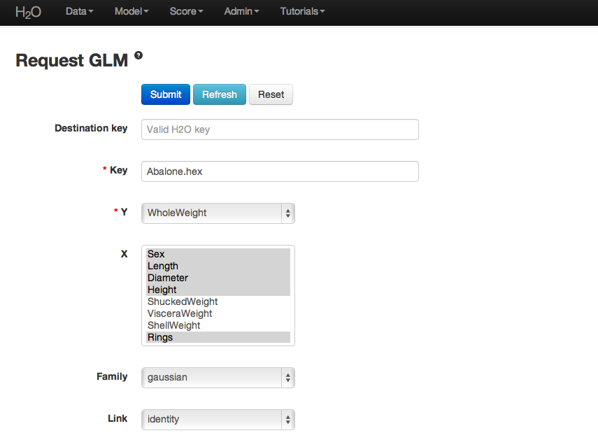

GLM Tutorial
------------

The purpose of this tutorial is to walk the new user through 
a GLM analysis beginning to end. Those who have never used 
H2O before should knwo how to specify, run, and interpret 
a GLM model. 

Getting Started
"""""""""""""""

This tutorial uses a publicly available data set that can be found

::

  Abalone data set http://archive.ics.uci.edu/ml/machine-learning-databases/abalone/

The original data are composed of 4177 observations and 7 attributes,
and have been split into 90%/10% train/ test sets through random
assignment. All attributes are real valued continuous, except for Sex
and Rings. Sex is categorical with 3 levels (male, female and infant),
and Rings is discrete. 

Before modeling, parse data into H2O as follows:

#. Under the drop down menu Data select Upload and use the helper to
   upload data.  

#. After uploading page is redirected to a page with the header
   "Request Parse". Select whether the first row of the data set is a
   header as appropriate. All other settings can be left in
   default. Press Submit. 

#. Parsing data into H2O generates a .hex key ("data name.hex")

For this tutorial two data sets will need to be parsed: the testing
set and the training set. Split your data appropriately and parse them
both now. 

After parsing:

Building a Model
""""""""""""""""

#. Destination key will be automatically generated, but the user can
   define a different name. 

#. In the key field enter the .hex key for the training data set. 

#. In the Y field select the column associated  with the Whole Weight variable. 

#. In the X field select the columns associated with Sex, Length,
   Diameter, Height, and Rings. 

#. Specify Family to be Gaussian, which automatically sets the link
   field to identity. 

#. Leave lambda and alpha at default (to find detailed information on the
   specificaiton of tuning parameters see the user guide under
   algorithms in the documentation menu). 

#. Leave n-folds at 10. 

#. Select the box marked expert settings, and turn standardization
   OFF. 

.. image:: GLMrequest2.png

GLM Results
"""""""""""

GLM output includes coefficients (and normalized coefficients when
standardization is requested as well). Also reported are the AIC and
the error rate. A specification of the model is printed across the top
of the GLM results page in red. 

Users should note that if they wish to replicate results between H2O
and R, it is recommended that standardization and cross validation
either be turned off in H2O, or turned on with the same number of
cross validation models in R. Otherwise results may differ. 

Validating on Testing Set
"""""""""""""""""""""""""

#. At the top of the GLM results page is a horizontal menu titled
   Actions. Select Validate on another dataset. This same action can
   be completed by going to the Score drop down menu and selecting GLM. 

#. In model key enter the model key found in the center of the GLM
   results page under the header Validations (this can also be found
   under the Admin drop down menu by selecting Jobs). 

#. In the Key field enter the .hex key associated with the testing
   data set (originally parsed at the beginning of the session). Press
   submit. 

Validation results report models statistics like those originally
generated when the model was built. It should give users an idea of
how well their model predicts. 

THE END. 

