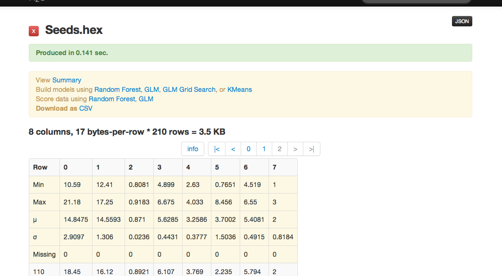
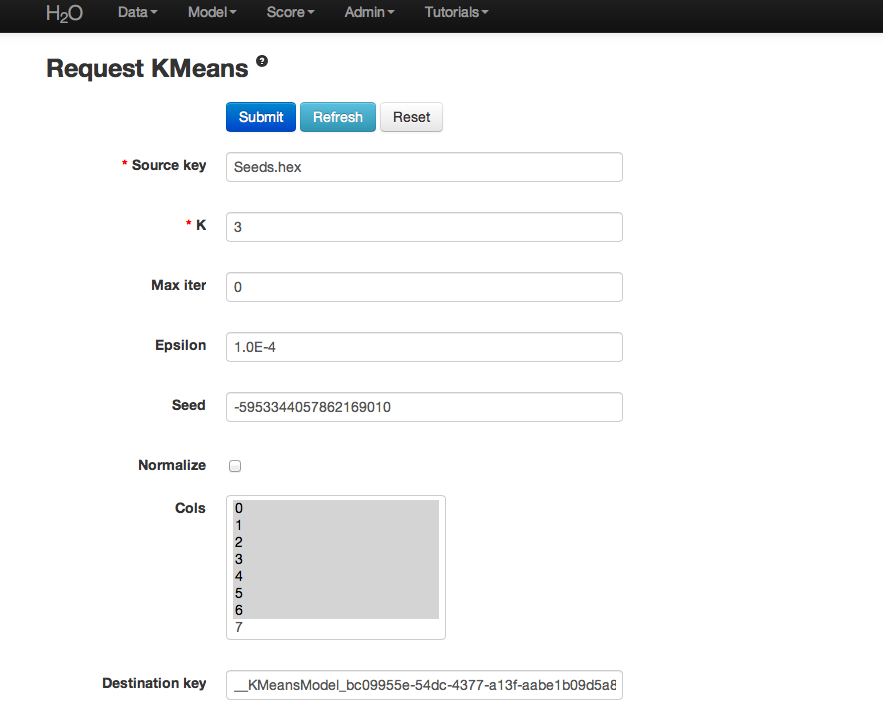
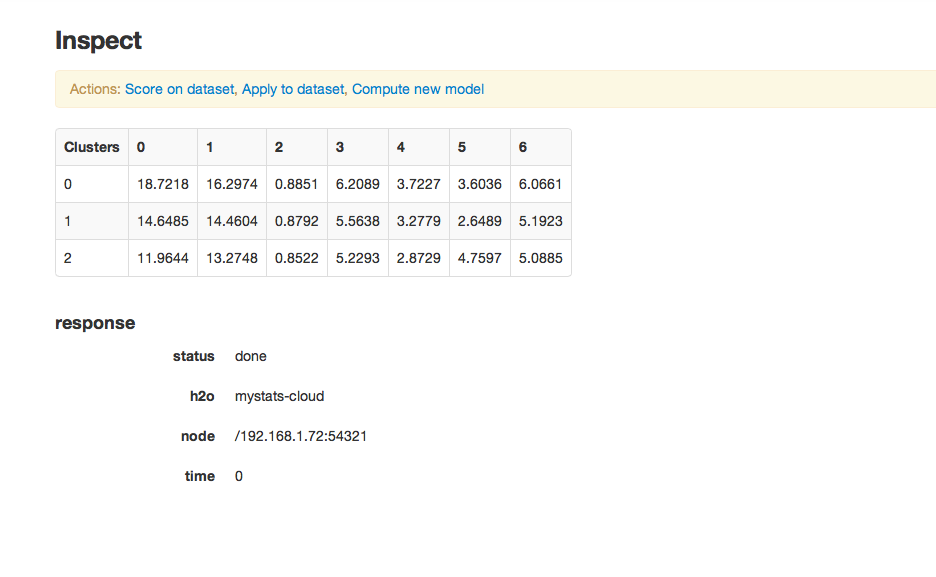
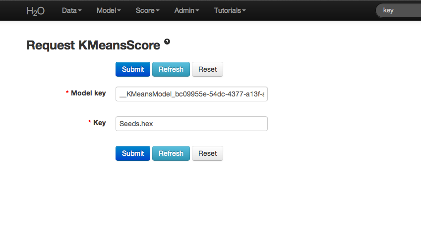
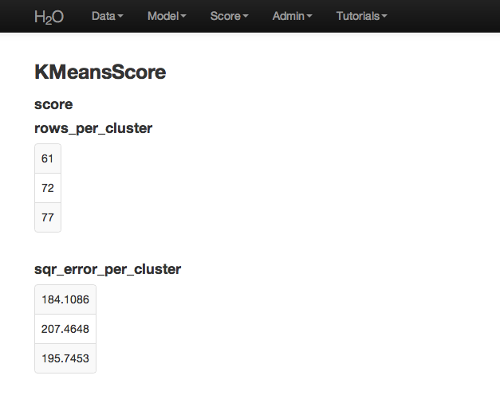
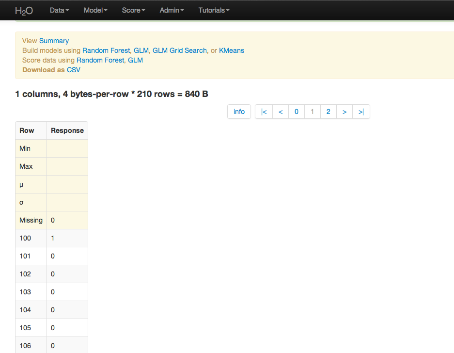

K Means Tutorial
-----------------

The purpose of this tutorial is to walk the new user through a 
K-Means analysis beginning to end. By the end of this tutorial
the user should know how to specify, run, and interpret a K-means model.

Those who have never used H2O before should see the quick start guide
for additional instructions on how to run H2O. 

Getting Started
"""""""""""""""

This tutorial uses a publicly available data set that can be found 

::
  Seeds data set http://archive.ics.uci.edu/ml/datasets/seeds 

The data are composed of 210 observations, 7 attributes, and an priori
grouping assignment. All data are positively valued and
continuous. Before modeling, parse data into H2O as follows:

#. Under the drop down menu Data select Upload and use the helper to
   upload data.

 
#. User will be redirected to a page with the header "Request
   Parse". Select whether the first row of the data set is a
   header. All other settings can be left in default. Press Submit.

#. Parsing data into H2O generates a .hex key ("data name.hex").

Building a Model
""""""""""""""""

#. Once  data are parsed a horizontal menu will appear at the top
   of the screen reading "Build model using ... ". Select 
   K Means here, or go to the drop down menu Model and
   select K-Means there.

#. In the field for Source Key enter the .hex key associated with the
   data set. 

#. Choose K. There is no hard and fast rule for how to
   do this. For this dataset K is chosen to be 3. 

#. Note that data can be normalized, though it is not done for this
   analysis. 

#. Max iter and Epsilon are both user defined tuning parameters that
   control the modeling process. Max iter allows the user to specify
   the maximum number of iterations the algorithm processes. Epsilon 
   specifies a threshold for the movement between one set of
   cluster centers and the next. If the new center moves less than
   epsilon, the algorithm terminates. Both accomplish the same ends
   through different means. Leave both in default for this analysis.

#. Cols is a list of the columns of attributes that should be used 
   in defining the clusters. Here we select all but column 7 (the 
   a priori known clusters for this particular set). 

#. Press submit.

K-Means Output
""""""""""""""

Output is a matrix of the cluster assignments, and the
coordinates of the cluster centers in terms of the originally 
chosen attributes. Your cluster centers may differ slightly. 
K-Means randomly chooses starting points and converges on 
optimal centroids. The cluster number is arbitrary, and should
be thought of as a factor.

The exact model can be reproduced by entering the same seed as was
originally used. This seed is 

::
 -5953344057862169010

K-means Score
"""""""""""""

For further information on the model select K-Means from the
drop down menu Score. Specify the K-Means model key, and the 
.hex key for the data set originally used. 

The output obtained when submit is pressed is the number of rows 
assigned to each cluster, and the squared error per cluster. 

K-means Apply
"""""""""""""

To generate a prediction (assign the observations in a data set
to a cluster) select K-means Apply from the Score drop down menu.
Specify the model to be applied and the  .hex for the data 
you would like to apply it to, and press submit. 

Here cluster assignments have been generated
for the original data. Because the data have been sufficiently well 
researched, the ideal cluster assignments were known in
advance. Comparing known cluster with predicted cluster demonstrated
that this K-Means model classfies with a less than 10% error rate. 

THE END.  
